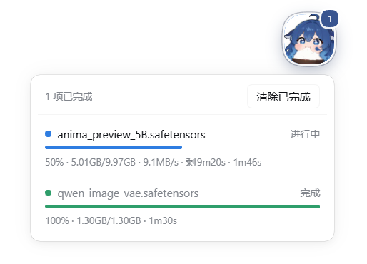

<div align="center">


# dsh-job-progress

**How far along is it?** — a floating ball in the session that owns the job answers that.

A DeepSeek Harness plugin showing live progress for long-running background jobs:
downloads, model conversions, renders, batch jobs — anything that runs in the background.

[](./LICENSE)
[](#compatibility)
[](#compatibility)
[](#features)
[](#contributing)
[](https://github.com/Rice00/dsh-job-progress/stargazers)



<sub>The ball floats over the conversation, badges the running count, and expands into the task panel.</sub>

[Features](#features) · [Install](#install) · [Quick start](#quick-start) · [Protocol](#the-progress-protocol) · [Verify](#verify-the-install) · [Troubleshooting](#troubleshooting) · [**中文**](./README.zh.md)

</div>

---

## Features

| | |
|---|---|
| 🟢 **Floating ball** | Appears only in sessions that have something to watch. The badge counts running tasks (`9+` above nine). |
| 🖱️ **Draggable** | Put it wherever you like; the position survives page reloads. |
| 📊 **Live panel** | One row per job: state dot, label, progress bar, `%`, `done/total`, speed, ETA, elapsed time. |
| 🧹 **Clear finished** | Deletes this session's finished progress files. Running entries are never touched. |
| 🤝 **No cooperation needed** | Jobs come from the registry, so an unreported job still shows up — just without a bar. |
| 🔒 **Session-scoped** | A session only ever sees its own jobs. Other sessions' work never leaks in. |
| 🧩 **Any job kind** | Shell commands, ComfyUI renders, anything that registers a background job. |
| 🔑 **Zero config** | No credentials, no tokens, no network calls: it reads the job registry and its own files. |
| 📦 **No build step** | The client plugin is a hand-written module-loader module; no bundler output to keep in sync. |

## Install

### From a local folder (recommended)

```bash
git clone https://github.com/Rice00/dsh-job-progress.git
dsh plugin --profile <profile> add link:/abs/path/to/dsh-job-progress   # the checkout from above
```

The bundle patch inserts one row (`job-progress`) into the profile. Then **restart that profile** —
host plugin modules are cached in-process, so a running harness will not pick the row up.

`link:` is a live link: **edits to the source folder take effect immediately** (after a restart for
host code, after a refresh for UI code), but the folder must not be moved afterwards. To copy the
files instead, use `file:/abs/path/to/dsh-job-progress` — then later edits need a re-install.

### From GitHub or npm

```bash
dsh plugin --profile <profile> add github:Rice00/dsh-job-progress
dsh plugin --profile <profile> add dsh-job-progress        # once published to npm
```

### For an AI assistant (copy-paste)

```
Please install the DSH plugin dsh-job-progress for me:

1) Install it into the web profile, from GitHub:
     dsh plugin --profile web add github:Rice00/dsh-job-progress
   or from a local checkout (absolute path of the folder):
     dsh plugin --profile web add link:<absolute-path>
2) Restart that profile — host plugin modules are cached in-process, so the new row is
   only picked up on boot. (UI-only changes just need a browser refresh.)
3) Verify:
     node <absolute-path>/test/preflight-client.mjs      → must print "ALL PASS (12)"
     the host log must contain:  job-progress: mounted, progress root …
   On Windows the host log is under %APPDATA%\DSH Desktop\logs\host\.
   If DSH starts normally and no new errors appear in the renderer console, you are done.
```

## Quick start

Nothing to configure — run something in the background and the ball appears:

```bash
node download.mjs https://example.com/model.safetensors    # run_in_background
```

To get a progress bar, have the producer report numbers (one file, any language):

```js
import { track } from 'dsh-job-progress/progress';

const t = track({ label: 'model.safetensors', total: 66000000 });
t.update(bytesSoFar);        // speed + ETA are measured for you
t.phase('verifying');
t.finish('done');            // or t.finish('failed', 'sha256 mismatch')
```

Or straight from a shell, no import needed:

```bash
node <plugin>/lib/dsh-progress.mjs set --label model.safetensors --done 12 --total 100
node <plugin>/lib/dsh-progress.mjs done --key model.safetensors
```

## How it works

```
producer (your script)          host plugin                     client plugin (browser)
  track({ label, total })  ──▶  reads <DSH_HOME>/job-progress/  ──▶  polls jobProgress/snapshot
  writes <key>.json             <DSH_SESSION_ID>/*.json              every 2 s and renders the
                                + registry snapshots                 ball, badge and panel
```

The ball's position and the per-session "already cleared" list live in `localStorage`.

## The progress protocol

A producer writes one JSON file per task into the session's progress directory:

```
<DSH_HOME>/job-progress/<DSH_SESSION_ID>/<key>.json
```

Both environment values already exist in every agent shell call, so a producer never has to be
told a path.

```json
{
  "label": "anima_preview_5B.safetensors",
  "done": 4187599360,
  "total": 9972879360,
  "unit": "bytes",
  "speed": 13107200,
  "eta": 440,
  "phase": "download",
  "status": "running",
  "note": "",
  "jobId": "bash-3",
  "updatedAt": 1758000000000
}
```

| field | meaning |
|---|---|
| `label` | shown in the panel; also how an entry is matched to a registry job |
| `done` / `total` | units completed; `total: 0` renders as "running, unknown size" |
| `unit` | `bytes` (default, rendered KiB/MiB/GiB) or `count` (rendered raw) |
| `speed` / `eta` | optional; nothing is invented when they are absent |
| `phase` | free text; `merging` and `verifying` get built-in labels |
| `status` | `running` \| `done` \| `failed` |
| `jobId` | optional; pins the entry to a registry job instead of matching by label |
| `updatedAt` | ms-epoch heartbeat |

**Heartbeat.** While `status` is `running`, refresh `updatedAt` at least every ~15 s. A live entry
that stops refreshing is treated as gone, because a producer that stopped writing is
indistinguishable from one that crashed. `done` / `failed` entries stay visible for two minutes.

**Atomic writes.** Write `<file>.tmp`, then rename over the target; a reader must never observe a
half-written record.

### CLI reference

| command | effect |
|---|---|
| `set --label <name> [--done N] [--total N] [--unit bytes\|count] [--phase P]` | create or continue a record |
| `done --key <key> [--note "..."]` | mark it finished |
| `failed --key <key> --note "..."` | mark it failed |
| `dir` | print the resolved progress directory |
| `clear [--key <key>]` | delete this session's progress files |

## Clearing

**Clear finished** deletes every finished progress file of this session; running entries are never
touched.

Registry jobs cannot be deleted — they are read-only projections — so terminal job rows are
recorded in a per-session ignore list and stop appearing. That key includes the job's `startedAt`,
because job ids are `<kind>-N` counted per process and a restart would otherwise let a stale ignore
entry hide a brand-new job.

The host refuses a session id containing a path separator or `..`, and requires the session to
actually exist: the id doubles as a directory name, so this is a path-traversal fence, not a
formality. If the host does not answer, the UI reports the failure and changes nothing — it never
claims a clear that did not happen.

## Compatibility

| | |
|---|---|
| **DSH** | tested on `0.1.5-rc.2`; works in the browser GUI and in the web host embedded in the Desktop app |
| **Profile** | any profile that carries the web UI (`web`, and `desktop` when the same row is added there) |
| **Runtime** | Node 22+ (the plugin adds no dependencies of its own) |
| **Job kinds** | anything registered in `ctx.jobs`, regardless of kind |
| **Requirements** | no credentials, no tokens, no network access |

## Verify the install

```bash
# 1) the client plugin: module contract, slot registration, one render pass
node test/preflight-client.mjs            # → ALL PASS (12)

# 2) the host plugin mounted (Windows Desktop app)
Select-String -Path "$env:APPDATA\DSH Desktop\logs\host\dsh-*.log" -Pattern 'job-progress'
#    → dsh-job-progress: mounted, progress root …\.dsh\job-progress

# 3) the row is in the profile
dsh --profile <profile> --dump-config | Select-String 'job-progress'
```

Then start a background job in any session and hover the ball.

## Troubleshooting

| symptom | cause | fix |
|---|---|---|
| The ball never appears | the session has no background jobs and no progress files | start a background job, or write a progress file |
| UI changes seem ignored | the client plugin is fetched on page load | refresh the page (F5) |
| Changes to `lib/index.js` seem ignored | host plugin modules are cached in-process | restart the profile |
| `Clear failed: host not ready` | the running host predates the `clear` endpoint | restart the profile |
| Something renders as a squircle | the app's global `corner-shape` | see "For plugin authors" below |
| "Did the row even load?" | check the host log | `dsh-job-progress: mounted, progress root …` |
| A task disappeared before it finished | the producer stopped writing for 15 s (crashed or killed) | make sure the producer keeps the heartbeat, or set `DSH_PROGRESS` writers accordingly |

<details>
<summary><b>Design notes — why there is a file protocol at all</b></summary>

Two properties of the harness shaped this design. Both were verified against the shipped packages,
not assumed:

1. **The job registry carries no progress.** `ctx.jobs` records an id, kind, label, status
   (`running → stopping → completed | killed | failed`) and timestamps — no field a producer could
   fill with a percentage.
2. **Job output cannot be sampled.** `ShellProcess.readOutput` is *incremental* (consecutive reads
   never repeat output) and `ctx.jobs.read()` marks a terminal job as reported. A panel that polled
   job output to parse percentages would steal output the model is about to read and swallow its
   completion notice. This plugin never calls `read()`; it reads only **registry snapshots** (pure
   projections) plus its own files.

So progress has to be reported by whatever does the work, while job discovery stays automatic.

</details>

<details>
<summary><b>For plugin authors — circles in this GUI</b></summary>

The app sets **`corner-shape: superellipse(1.5)` globally**. Under that setting *every*
`border-radius` — including `50%` — paints as a **squircle**, not as a circular arc. A computed
`border-radius: 50%` is therefore not evidence that something renders as a circle. The app's own
stylesheets opt specific elements back with `corner-shape: round` (spinners, dots, switch thumbs).
Add that declaration when you need a true circle:

```css
border-radius: 50%;
corner-shape: round;   /* omit it and you get a squircle — which may well be what you want */
```

This plugin deliberately keeps the squircle: it matches the GUI's own design language.

</details>

<details>
<summary><b>Development</b></summary>

```bash
node test/preflight-client.mjs     # no install, no browser needed
```

The client plugin runs in the browser, where its errors land in a renderer console that is not
written to disk — so a broken client plugin looks exactly like a plugin that never loaded. The
preflight loads `lib/client.js` through a stubbed module loader and exercises the factory, `apply`,
slot registration and one render pass against a stub React. It caught a missing `module`/`exports`
declaration and a render-gate regression while this plugin was being written.

```
cordis.patch.yml            bundle patch: inserts the `job-progress` row
package.json                manifest: bundle patch + web client plugin
lib/client.js               client plugin: ball, drag, panel, clear
lib/index.js                host plugin: registry snapshots + progress dir + jobProgress/clear
lib/dsh-progress.mjs        producer side: protocol, helper, CLI
test/preflight-client.mjs   12 checks for the client plugin
assets/                     logo and screenshot used by this README
```

The host plugin registers a Typert Remote service (`jobProgress`) reached through the standard
`/api` gateway as `jobProgress/snapshot` and `jobProgress/clear`. Set `debug: true` on the
`job-progress` row to have the snapshot response carry which registries were found and how many
entries and jobs were matched.

</details>

## Uninstall

```bash
dsh plugin --profile <profile> remove dsh-job-progress
```

Progress files written by producers stay under `<DSH_HOME>/job-progress/` — delete them yourself if
you no longer need them. The plugin never deletes anything outside that directory.

## Roadmap

- [ ] Jobs owned by subagents (today a session sees its own owner's jobs only)
- [ ] Move the icon and any large assets to a host route instead of an inlined data URI
- [ ] Richer phases, so a producer can announce arbitrary stages with labels
- [ ] More translations of this README

## Contributing

[Issues](https://github.com/Rice00/dsh-job-progress/issues) and pull requests are welcome. Before
opening a PR:

```bash
node test/preflight-client.mjs     # must print ALL PASS
```

Keep the client plugin dependency-free (React only) and run the preflight after any edit — it exists
because client-side mistakes are otherwise invisible.

## License

[MIT](./LICENSE)

<div align="center">

MIT License © dsh-job-progress contributors

</div>
